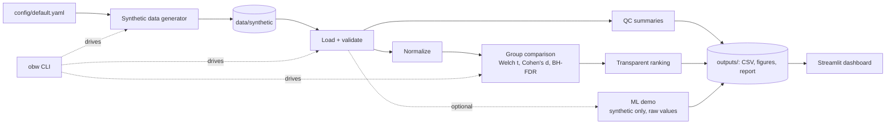
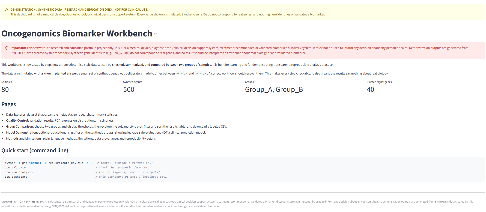
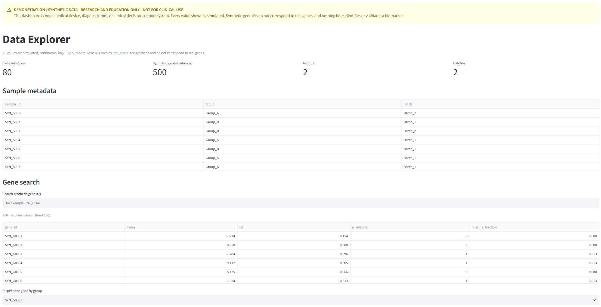
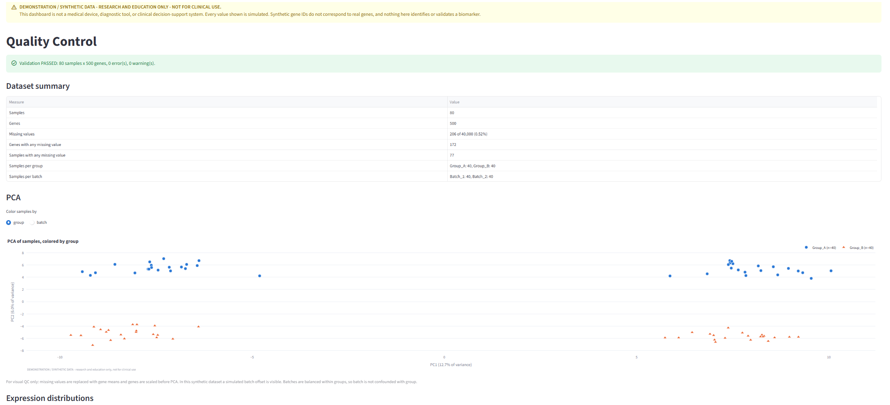
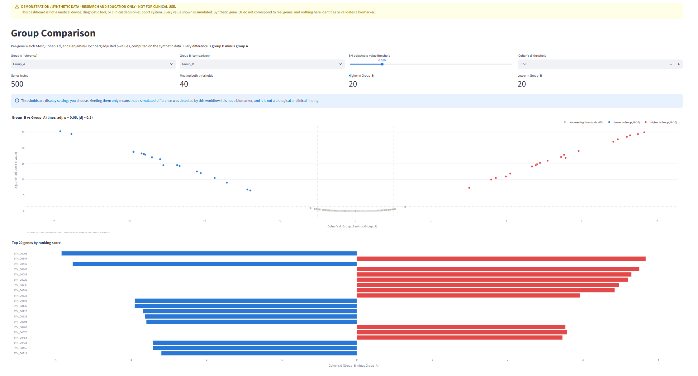
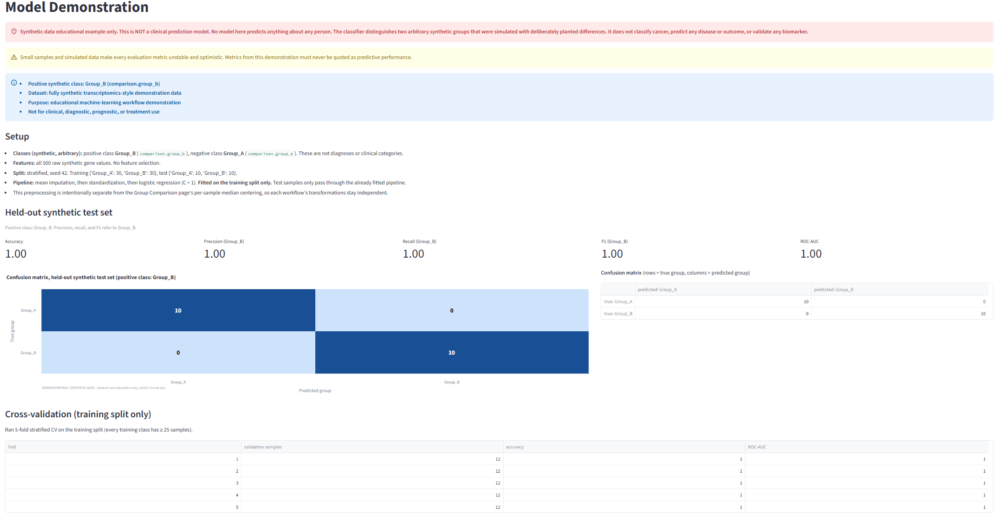
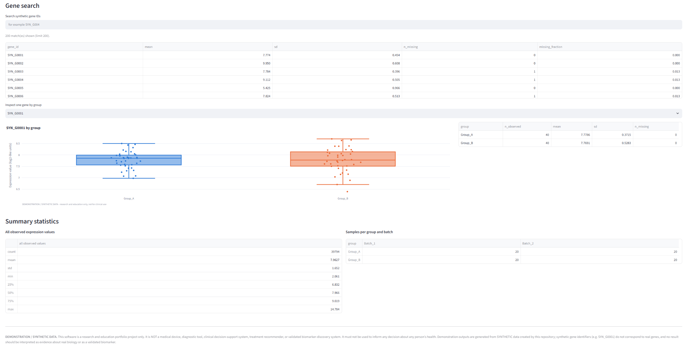
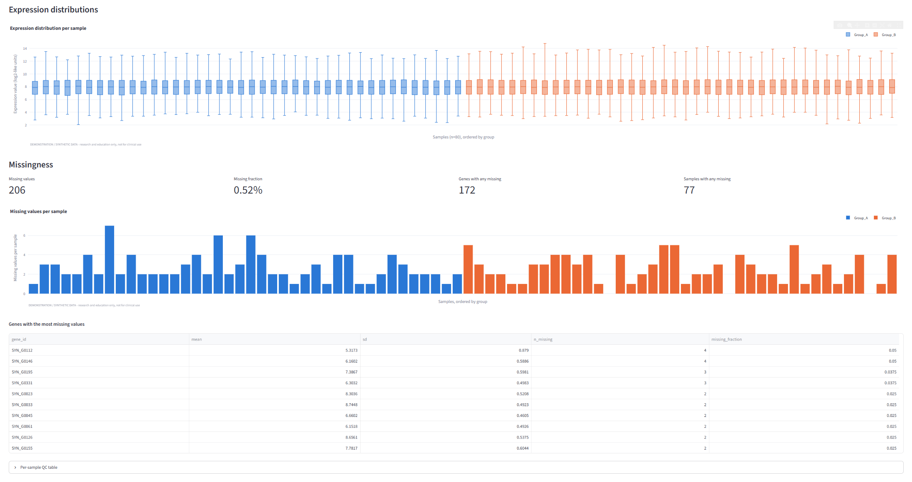
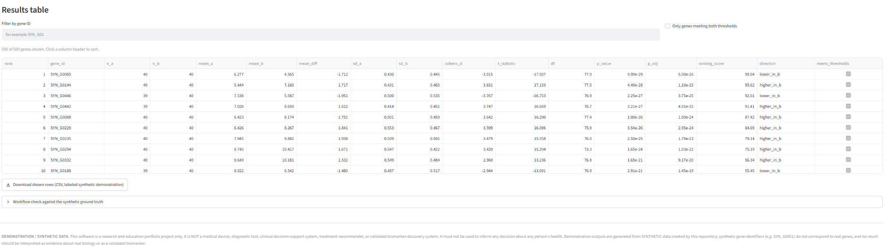
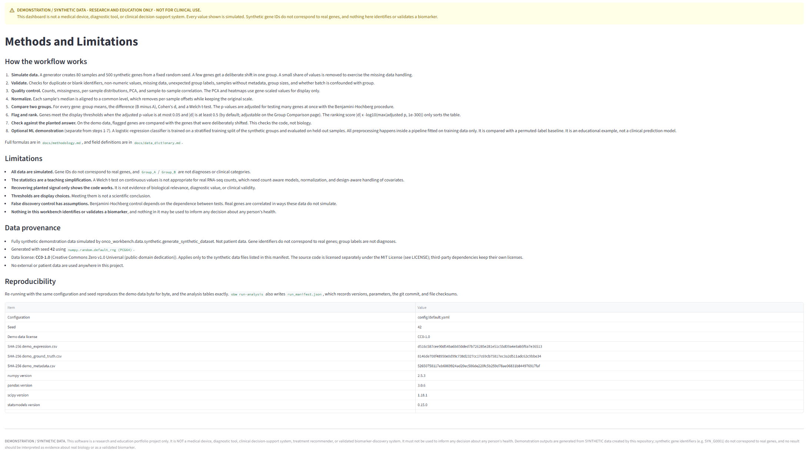

# oncogenomics-biomarker-workbench

[](https://github.com/JonathanMCopelandJr/oncogenomics-biomarker-workbench/actions/workflows/ci.yml)

> [!WARNING]
> **RESEARCH AND EDUCATION ONLY - NOT FOR CLINICAL USE.**
> This project is **not** a medical device, diagnostic tool, clinical decision-support
> system, treatment recommender, or validated biomarker-discovery system. It must not be
> used to inform any decision about any person's health. All demonstration data are
> **SYNTHETIC**, generated by this repository, and do not describe real patients or
> real genes.

**Project status:** All five planned phases are complete, plus the optional educational
ML demonstration and a walkthrough notebook (version 0.1.0, **not yet released**). See
[`docs/release_checklist.md`](docs/release_checklist.md) for what remains before a release.

## Summary

A reproducible, open-source workbench that shows, step by step, how a
transcriptomics-style dataset can be checked, summarized, and compared between two
groups of samples. It uses **simulated data with a known, planted answer**, so every
step can be checked: if the workflow is correct, it should recover the genes that were
deliberately simulated to differ. Results can be explored in an interactive dashboard
built for non-programmers.

## Architecture



All logic lives in the `onco_workbench` Python package. The CLI, the notebooks, and the
dashboard are thin layers on top of it. See [`docs/architecture.md`](docs/architecture.md).

## Features

| Feature | Status |
|---|---|
| Package skeleton, config, CLI entry point, disclaimers | Done (Phase 1) |
| Synthetic data generator with planted signal genes | Done (Phase 2) |
| Schema and data-quality validation | Done (Phase 2) |
| QC report: counts, missingness, distributions, PCA, correlation heatmap | Done (Phase 3) |
| Two-group comparison: means, difference, Cohen's d, Welch t-test, BH-adjusted p | Done (Phase 3) |
| Transparent ranking score, volcano plot, top-gene chart, heatmap, CSV and Markdown exports | Done (Phase 3) |
| Run manifest (versions, parameters, checksums) and synthetic ground-truth check | Done (Phase 3) |
| Optional educational ML demonstration (leakage-safe pipeline, permuted-label baseline; NOT a clinical model) | Done (`obw ml-demo`) |
| Streamlit dashboard (6 pages, local only, synthetic demo data only) | Done (Phase 4) |
| CI, community files, citation metadata | Planned (Phase 5) |

## Repository layout

```
app/                  Streamlit dashboard pages (UI only; logic lives in the package)
config/               YAML configuration (seed, paths, thresholds)
data/raw/             user-supplied data, ignored by Git
data/synthetic/       small synthetic demo data (~267 KB, CC0-1.0, regenerable)
data/processed/       intermediate files, ignored by Git
docs/                 methodology, architecture, ethics, reproducibility, plans
notebooks/            5-10 minute walkthrough notebook (outputs stripped)
outputs/              generated results, ignored by Git
src/onco_workbench/   the Python package (all business logic)
tests/                pytest suite
```

## Installation

Requires Python 3.11 or newer. Dependencies are managed with **pip**. `pyproject.toml`
declares compatible version ranges, and `requirements*.txt` pin the exact tested versions
(see [`docs/reproducibility.md`](docs/reproducibility.md)).

**macOS / Linux**

```bash
python3 -m venv .venv
source .venv/bin/activate
python -m pip install --upgrade pip
python -m pip install -r requirements-dev.txt -e .
```

**Windows (PowerShell)**

```powershell
py -3.12 -m venv .venv
.\.venv\Scripts\Activate.ps1
python -m pip install --upgrade pip
python -m pip install -r requirements-dev.txt -e .
```

No credentials, API keys, or downloads are required.

Notes:

- Install from a **clone of this repository** (editable install, as above). The CLI and
  dashboard read `config/`, `app/`, and `data/synthetic/` from the repository, and these
  are not included in a built wheel.
- **Windows:** if installation fails with `WinError 206` ("filename or extension is too
  long"), create the virtual environment in a shorter path (for example `C:\venvs\obw`)
  or enable Windows long-path support.

## Quick start

| Step | Command (any OS) | `make` shortcut (macOS/Linux) |
|---|---|---|
| Show disclaimer | `obw disclaimer` | |
| Regenerate demo data (already committed) | `obw generate-data` | `make generate-demo-data` |
| Validate data | `obw validate` (or `--expression X.csv --metadata Y.csv`) | |
| QC only | `obw qc` | `make qc` |
| Full analysis | `obw run-analysis` | `make run-analysis` |
| Optional ML demonstration | `obw ml-demo` | `make ml-demo` |
| Launch dashboard | `obw dashboard` | `make run-dashboard` |

`obw run-analysis` takes `--group-a`, `--group-b`, `--fdr-threshold`,
`--effect-size-threshold`, `--expression`, `--metadata`, `--ground-truth`,
`--output-dir`, and `--config`. Defaults come from `config/default.yaml`.

### Optional ML demonstration (`obw ml-demo`)

> **Synthetic-data educational example only. This is NOT a clinical prediction model.**
> It distinguishes the two arbitrary synthetic groups. It does not classify cancer,
> predict any disease or outcome, or validate any biomarker.

This is a separate, optional workflow; `obw run-analysis` does not run it.

- **Classes:** the positive class is `comparison.group_b` (`Group_B`) and the negative
  class is `comparison.group_a` (`Group_A`).
- **Split:** stratified and seeded from the configuration.
- **Pipeline:** mean imputation, then standardization, then logistic regression, fitted
  on the **training split only**, using all raw synthetic genes with no feature selection.
- **Cross-validation:** runs on the training split only, when class sizes allow.
- **Results:** test-set accuracy, precision, recall, F1, ROC-AUC (when defined), and a
  confusion matrix.
- **Permuted-label baseline:** a sanity check, not a biological benchmark.

The outputs go to `outputs/ml_demo/`: `ml_demo_results.json`, `confusion_matrix.csv`,
`test_predictions.csv`, and `summary.md`. All are labeled, and no model weights are
written. **High scores are expected by construction** on these synthetic data. See the
limitations in [`docs/limitations_and_ethics.md`](docs/limitations_and_ethics.md) and the
method in [`docs/methodology.md`](docs/methodology.md).

### What the analysis produces

All outputs go to `outputs/`, which is ignored by Git. Each one is labeled
**DEMONSTRATION / SYNTHETIC**:

| Output | Contents |
|---|---|
| `report.md` | Markdown summary: disclaimer, run info, QC, normalization, comparison settings, top-ranked genes, synthetic ground-truth check, interpretation limits |
| `tables/*.csv` | Full per-gene comparison results, top-ranked genes, per-sample and per-gene QC, PCA scores |
| `figures/*.png` | PCA (by group and batch), expression distributions, sample totals, sample correlation, volcano-style plot, top-gene bar chart, top-gene heatmap |
| `run_manifest.json` | Versions, git commit, parameters, and SHA-256 checksums of inputs and outputs |

Column definitions are in [`docs/data_dictionary.md`](docs/data_dictionary.md#analysis-outputs-obw-qc--obw-run-analysis).
The statistics are documented in [`docs/methodology.md`](docs/methodology.md).

### Running the dashboard

From the repository root, inside the activated virtual environment:

```bash
obw dashboard                 # opens http://localhost:8501 in your browser
obw dashboard --port 8502     # use another port
obw dashboard --headless      # do not open a browser automatically
```

Stop it with **Ctrl+C**. `obw dashboard` runs `python -m streamlit run app/Home.py`
with the server bound to `localhost` and usage statistics turned off. Running that
command yourself from the repository root is equivalent, because `.streamlit/config.toml`
sets the same options. The dashboard reads only the committed synthetic demo files. It
has no upload, external data ingestion, authentication, or deployment configuration.

| Page | What it shows |
|---|---|
| Home | Overview, full disclaimer, dataset at a glance, quick start |
| Data Explorer | Dataset shape, metadata table, searchable gene list with a per-gene view, summary statistics |
| Quality Control | Validation result, PCA (by group or batch), expression distributions, missingness |
| Group Comparison | Choose groups and thresholds; interactive volcano-style plot, top genes, sortable and filterable results table, labeled CSV download, ground-truth check |
| Model Demonstration | Optional educational classifier on the synthetic groups (positive class `Group_B`): setup, test metrics, confusion matrix, CV, permuted-label comparison, and limitations. NOT a clinical prediction model |
| Methods and Limitations | Plain-language workflow, limitations, data provenance, reproducibility details |

Every page shows the research-only / synthetic-data banner at the top and the full
disclaimer at the bottom.

### Walkthrough notebook

[`notebooks/oncogenomics_workbench_walkthrough.ipynb`](notebooks/oncogenomics_workbench_walkthrough.ipynb)
is a 5–10 minute tour of the whole workflow on the synthetic demo data:

- data loading and in-memory regeneration
- validation and QC
- PCA
- the group comparison, the ranked simulated genes, a volcano-style plot, and a heatmap
- the ground-truth check
- a summary of the ML demonstration

Every cell calls the `onco_workbench` package, and none re-implements the analysis. The
notebook is committed with outputs stripped. Apparent differences and ranked genes
reflect **intentionally implanted synthetic signals**, not biomarkers or biological
findings.

Jupyter is **optional**. It is not part of the core requirements. The exact tested
versions are pinned in `requirements-notebooks.txt`, and `pyproject.toml` also declares
them as a bounded `notebooks` extra.

**Windows (PowerShell)**, from the repository root with the virtual environment activated:

```powershell
python -m pip install -r requirements-dev.txt -r requirements-notebooks.txt -e .
python -m jupyterlab notebooks\oncogenomics_workbench_walkthrough.ipynb
# or execute it headlessly into a temporary copy (the committed file stays output-free):
python -m nbconvert --to notebook --execute notebooks\oncogenomics_workbench_walkthrough.ipynb --output-dir $env:TEMP\obw-notebook
```

**macOS / Linux:** use the same commands with `/` in paths and, for example,
`--output-dir /tmp/obw-notebook`.

Always use `python -m …` from the activated environment. A plain `jupyter` command can
resolve to a different, globally installed Jupyter whose kernel lacks this project,
which fails with `ModuleNotFoundError: onco_workbench`. The test suite also runs every
notebook cell (`tests/test_notebook.py`) without Jupyter.

## Dashboard Screenshots

These screenshots were captured from the dashboard running locally (`obw dashboard`) on
the committed **synthetic** demo data. Every value shown is simulated. Group labels are
arbitrary, gene IDs (`SYN_G…`) are not real genes, and nothing shown is a biomarker,
diagnosis, or clinical result. **Research and education only; not for clinical use.**

**Home.** Project overview with the research-only / synthetic-data disclaimers, the
dataset at a glance (80 samples, 500 synthetic genes, `Group_A` and `Group_B`, 40
planted signal genes), the list of pages, and quick-start commands.



**Data Explorer.** Dataset shape (80 samples × 500 synthetic genes, 2 groups, 2
batches), the sample metadata table, and a searchable list of synthetic gene IDs with
per-gene summaries.



**Quality Control.** Validation passed (80 samples × 500 genes, 0 errors, 0 warnings),
the dataset summary (0.52% missing values), and PCA of the samples colored by synthetic
group.



**Group Comparison.** Group_B vs Group_A at the default display thresholds (BH-adjusted
p ≤ 0.05, |Cohen's d| ≥ 0.5): 500 genes tested and 40 meeting both thresholds (20
higher and 20 lower in Group_B). There is also a volcano-style plot and the top 20
genes by ranking score. These are the **intentionally planted synthetic differences**.



**Model Demonstration.** The optional educational classifier, labeled "NOT a clinical
prediction model". It shows the positive class (Group_B), the setup (stratified split,
pipeline fitted on the training split only), held-out synthetic test-set metrics, a
confusion matrix, and 5-fold cross-validation on the training split. The perfect scores
on 20 synthetic test samples are **expected by construction** and are not a performance
claim.



### Additional Views

<table>
  <tr>
    <td width="50%">
      
      <br><sub><b>Gene detail:</b> one synthetic gene by group, with per-group and overall summary statistics.</sub>
    </td>
    <td width="50%">
      
      <br><sub><b>QC detail:</b> per-sample expression distributions and missing-value summaries.</sub>
    </td>
  </tr>
  <tr>
    <td width="50%">
      
      <br><sub><b>Results table:</b> sortable, filterable per-gene statistics and a labeled synthetic CSV download.</sub>
    </td>
    <td width="50%">
      
      <br><sub><b>Methods and Limitations:</b> workflow, limitations, data provenance, and reproducibility details.</sub>
    </td>
  </tr>
</table>

## Data provenance

- The project ships **no external or patient data**.
- The demo data in `data/synthetic/` (80 samples x 500 genes, about 267 KB in total)
  are **fully simulated** by this repository's generator from the fixed seed in
  `config/default.yaml`. Gene identifiers are neutral (`SYN_G0001`, ...) and do not
  correspond to real genes. Group labels (`Group_A`, `Group_B`) are arbitrary and do
  not represent diagnoses. Every file is labeled DEMONSTRATION / SYNTHETIC.
- **To regenerate:** run `obw generate-data`. The output is byte-identical for the same
  seed, and a test checks this against the committed SHA-256 checksums.
- See [`data/synthetic/README.md`](data/synthetic/README.md) and
  [`docs/data_dictionary.md`](docs/data_dictionary.md).

## Reproducibility

Fixed random seed, pinned dependencies, path handling via `pathlib`, normalized line
endings, a deterministic analysis pipeline, and a run manifest that records
configuration, versions, git commit, and file checksums. Details:
[`docs/reproducibility.md`](docs/reproducibility.md).

## Testing and linting

```bash
python -m ruff format --check src tests app   # formatting
python -m ruff check src tests app            # lint
python -m pytest                          # tests (includes end-to-end runs)
python -m pytest -m "not e2e"             # faster: skip full demo-data runs
python -m pytest --cov                    # tests with coverage
```

**Continuous integration** (`.github/workflows/ci.yml`) runs the same lint checks and the
full test suite, `obw validate`, and an end-to-end `obw run-analysis` on every push and
pull request. The test matrix covers Ubuntu (Python 3.11 and 3.12), Windows, and macOS
(Python 3.12). CI needs no secrets and never deploys or publishes anything.

## Limitations

This is an educational demonstration on simulated data. The simple statistics used
(Welch t-test on continuous values) are **not** appropriate for real RNA-seq count
data. Results on synthetic data show only that the code recovers what was planted,
and say nothing about real biology. See
[`docs/limitations_and_ethics.md`](docs/limitations_and_ethics.md).

## Related Work and Future Extensions

This workbench is an **independent implementation**. It uses transparent classical
statistics and one baseline logistic-regression demonstration on **fully synthetic
transcriptomics-style data**. It does not use deep learning.

To place the project in the broader landscape of deep learning in biology, the public
curated list [hussius/deeplearning-biology](https://github.com/hussius/deeplearning-biology)
was consulted **only as a discovery index**. This project does not copy, reproduce,
vendor, depend on, benchmark against, or claim results from any implementation listed
there.

A possible future extension, a small autoencoder trained on this repository's synthetic
data for teaching, is described in [`docs/related_work.md`](docs/related_work.md). It is
**not implemented**. If it is ever built, it would use synthetic data only and remain
educational and nonclinical, with no patient or clinical data, pretrained biological
models, external weights, or unverified external datasets.

## Skills demonstrated

| Area | Where |
|---|---|
| Python packaging (src layout, type hints, docstrings) | `src/onco_workbench/`, `pyproject.toml` |
| Statistics (Welch t-test, effect sizes, BH-FDR), cross-checked against SciPy | `src/onco_workbench/analysis/` |
| Machine learning (leakage-safe pipelines, stratified CV, permutation baseline, leakage tests) | `src/onco_workbench/ml/classifier_demo.py` |
| Data validation | `src/onco_workbench/data/validation.py` |
| Visualization (matplotlib and plotly, CVD-validated palette) | `src/onco_workbench/viz/` |
| Pipeline orchestration and CLI | `src/onco_workbench/pipeline.py`, `src/onco_workbench/cli.py` |
| Reproducible research | `config/`, seeds, pins, run manifest |
| Streamlit (multipage app, caching, AppTest smoke tests) | `app/`, `src/onco_workbench/dashboard/` |
| Testing (pytest) | `tests/` |
| CI/CD (GitHub Actions: lint, cross-platform test matrix, end-to-end run) | `.github/workflows/ci.yml` |
| Scientific documentation and research ethics | `docs/` |

## Contributing

Contributions are welcome within the project's research-and-education boundary. See
[`CONTRIBUTING.md`](CONTRIBUTING.md) for setup, workflow, and the ground rules: no
clinical claims, no real or restricted data, and no fabricated results. Please follow the
[Code of Conduct](CODE_OF_CONDUCT.md), and report security issues privately as described
in [`SECURITY.md`](SECURITY.md). Changes are recorded in [`CHANGELOG.md`](CHANGELOG.md).

## Citation

If you use or refer to this software, please cite it using the metadata in
[`CITATION.cff`](CITATION.cff). GitHub shows a "Cite this repository" button for this
file. There is no associated publication.

## License

- **Code:** the [MIT License](LICENSE).
- **Synthetic demo data files** in `data/synthetic/`: dedicated to the public domain
  under [CC0-1.0](https://creativecommons.org/publicdomain/zero/1.0/). The CC0 dedication
  covers only those data files, not the source code. Third-party dependencies keep their
  own licenses. See [`data/synthetic/README.md`](data/synthetic/README.md#license-cc0-10-data-files-only).
