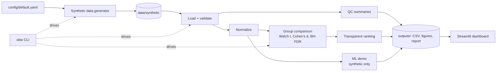

# oncogenomics-biomarker-workbench

> [!WARNING]
> **RESEARCH AND EDUCATION ONLY - NOT FOR CLINICAL USE.**
> This project is **not** a medical device, diagnostic tool, clinical decision-support
> system, treatment recommender, or validated biomarker-discovery system. It must not be
> used to inform any decision about any person's health. All demonstration data are
> **SYNTHETIC**, generated by this repository, and do not describe real patients or
> real genes.

**Project status:** Phase 1 (foundation) of 5. The analysis pipeline, synthetic data
generator, and dashboard are **not implemented yet**. Sections marked
`PLACEHOLDER` will be completed in later phases.

## Summary

A reproducible, open-source workbench that shows, step by step, how a
transcriptomics-style dataset can be checked, summarized, and compared between two
groups of samples. It uses **simulated data with a known, planted answer**, so every
step can be checked: if the workflow is correct, it should recover the genes that were
deliberately simulated to differ. Results can be explored in an interactive dashboard
built for non-programmers.

## Architecture



All logic lives in the `onco_workbench` Python package. The CLI, the notebooks, and the
dashboard are thin layers on top of it. See [`docs/architecture.md`](docs/architecture.md).

## Features

| Feature | Status |
|---|---|
| Package skeleton, config, CLI entry point, disclaimers | Done (Phase 1) |
| Synthetic data generator with planted signal genes | Planned (Phase 2) |
| Schema and data-quality validation | Planned (Phase 2) |
| QC report: counts, missingness, distributions, PCA, correlation heatmap | Planned (Phase 3) |
| Two-group comparison: means, difference, Cohen's d, Welch t-test, BH-adjusted p | Planned (Phase 3) |
| Transparent ranking score, volcano plot, top-gene chart, heatmap, CSV and Markdown exports | Planned (Phase 3) |
| Educational ML demonstration with leakage-safe pipeline | Planned (Phase 3) |
| Streamlit dashboard (6 pages) | Planned (Phase 4) |
| CI, community files, citation metadata | Planned (Phase 5) |

## Repository layout

```
app/                  Streamlit dashboard (Phase 4)
config/               YAML configuration (seed, paths, thresholds)
data/raw/             user-supplied data, ignored by Git
data/synthetic/       small synthetic demo data (Phase 2)
data/processed/       intermediate files, ignored by Git
docs/                 methodology, architecture, ethics, reproducibility, plans
notebooks/            walkthrough notebook (Phase 3)
outputs/              generated results, ignored by Git
src/onco_workbench/   the Python package (all business logic)
tests/                pytest suite
```

## Installation

Requires Python 3.11 or newer. Dependencies are managed with **pip**. `pyproject.toml`
declares compatible version ranges, and `requirements*.txt` pin the exact tested versions
(see [`docs/reproducibility.md`](docs/reproducibility.md)).

**macOS / Linux**

```bash
python3 -m venv .venv
source .venv/bin/activate
python -m pip install --upgrade pip
python -m pip install -r requirements-dev.txt -e .
```

**Windows (PowerShell)**

```powershell
py -3.12 -m venv .venv
.\.venv\Scripts\Activate.ps1
python -m pip install --upgrade pip
python -m pip install -r requirements-dev.txt -e .
```

No credentials, API keys, or downloads are required.

## Quick start

| Step | Command (any OS) | `make` shortcut (macOS/Linux) |
|---|---|---|
| Show disclaimer | `obw disclaimer` | |
| Generate demo data | `obw generate-data` (Phase 2) | `make generate-demo-data` |
| Run analysis | `obw run-analysis` (Phase 3) | `make run-analysis` |
| Launch dashboard | `obw dashboard` (Phase 4) | `make run-dashboard` |

## Screenshots

`PLACEHOLDER`: Screenshots will be captured from the real dashboard in Phase 4/5 and
stored in `docs/assets/screenshots/`. No images are shown until they exist.

## Data provenance

- The project ships **no external or patient data**.
- Demo data will be **fully simulated** by this repository's generator from a fixed seed
  in `config/default.yaml`. Gene identifiers are neutral (`SYN_G0001`, ...) and do not
  correspond to real genes. Group labels (`Group_A`, `Group_B`) are arbitrary and do
  not represent diagnoses.
- See [`data/synthetic/README.md`](data/synthetic/README.md) and
  [`docs/data_dictionary.md`](docs/data_dictionary.md).

## Reproducibility

Fixed random seed, pinned dependencies, path handling via `pathlib`, normalized line
endings, and (from Phase 3) a run manifest recording configuration and package
versions. Details: [`docs/reproducibility.md`](docs/reproducibility.md).

## Testing and linting

```bash
python -m ruff format --check src tests   # formatting
python -m ruff check src tests            # lint
python -m pytest                          # tests
python -m pytest --cov                    # tests with coverage
```

## Limitations

This is an educational demonstration on simulated data. The simple statistics used
(Welch t-test on continuous values) are **not** appropriate for real RNA-seq count
data. Results on synthetic data show only that the code recovers what was planted,
and say nothing about real biology. See
[`docs/limitations_and_ethics.md`](docs/limitations_and_ethics.md).

## Skills demonstrated

| Area | Where |
|---|---|
| Python packaging (src layout, type hints, docstrings) | `src/onco_workbench/`, `pyproject.toml` |
| Statistics (Welch t-test, effect sizes, BH-FDR) | `analysis/` (Phase 3) |
| Machine learning (leakage-safe pipelines, evaluation) | `ml/` (Phase 3) |
| Data validation | `data/validation.py` (Phase 2) |
| Visualization (plotly, matplotlib) | `viz/` (Phase 3) |
| Reproducible research | `config/`, seeds, pins, run manifest |
| Streamlit | `app/` (Phase 4) |
| Testing (pytest) | `tests/` |
| CI/CD (GitHub Actions) | `.github/workflows/` (Phase 5) |
| Scientific documentation and research ethics | `docs/` |

## Contributing

`PLACEHOLDER`: `CONTRIBUTING.md`, `CODE_OF_CONDUCT.md`, and `SECURITY.md` are added in
Phase 5. Until then, please open an issue before proposing changes.

## Citation

`PLACEHOLDER`: A `CITATION.cff` file is added in Phase 5. There is no associated
publication.

## License

Code is released under the [MIT License](LICENSE). The generated synthetic demo data
will be dedicated to the public domain (CC0-1.0), pending confirmation in Phase 2.
